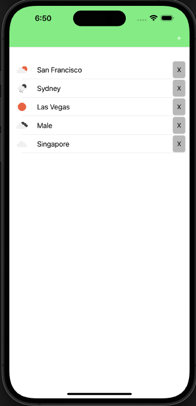
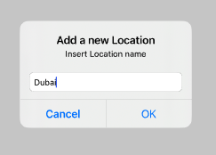
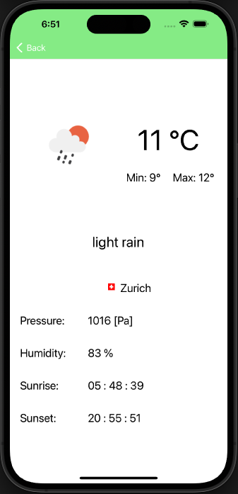

# WeatherApp

The scope of this simple WeatherApp is to get familiar with Xamarin, a cross-platform development framework.

## Used libraries
* Persistence: `sqlite-net-pcl`
* HTTP requests: `Microsoft.Net.Http`
* File structure and handling: `Newtonsoft.Json`
* Notifications: `Plugin.LocalNotification`
* CurrentLocation: `Xam.Plugin.Geolocator`

## Used API'S
* [OpenWeather Map](https://openweathermap.org/current): Used for weather retrieval and geocoding
* [FlagsApi](https://flagsapi.com/): Used to retrieve country flags

## Views

#### Home

The Home View contains all the saved locations of which we want to track the weather. It is possible to delete them through the `X` button or to add a new one through the `+` button placed in the top right corner.
Lastly, the first location is automatically generated, it displays the weather in our current position.
 

	

#### Add Location

In the Add Location View it is possible to add a new location to track by inserting its name.

	

#### View Location

When Viewing a Location, we can see all of the data relative to its weather.

	

## Contributors

* Jari Näser
* Marsildo Byketa